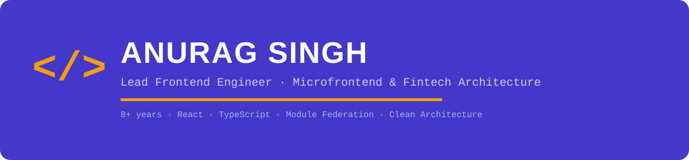
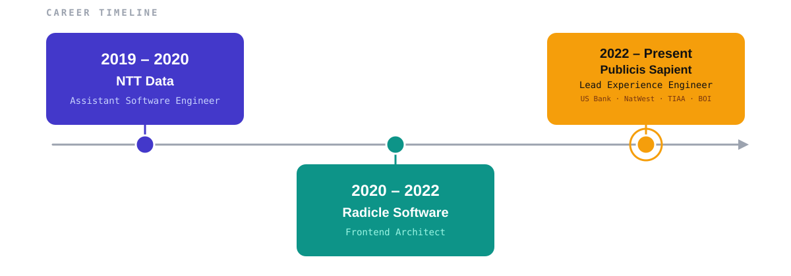
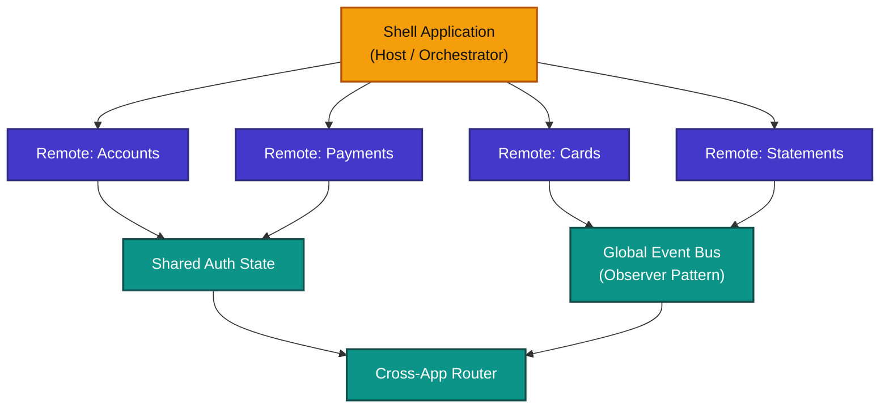
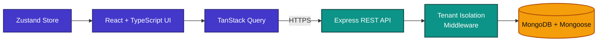

<div align="center">



<br /><br />

<a href="https://www.linkedin.com/in/anurag-singh-6661a5179/"></a>
<a href="https://github.com/aaasingh905"></a>
<a href="https://trestech.in"></a>

</div>

<br />

---

<br />

## About

I'm a software engineer with **8+ years** of experience designing and building large-scale, customer-facing applications — primarily across **fintech, banking, and SaaS platforms**. My work sits at the intersection of frontend architecture and backend systems: I care about how products are structured underneath as much as how they feel to use.

I'm currently a **Lead Software Engineer at Publicis Sapient**, working across enterprise banking engagements for US Bank, NatWest Group, TIAA, and Bank of Ireland. Alongside that, I run **[TresTech](https://trestech.in)** — my own SaaS venture, where I build vertical SaaS products end-to-end in my free time.

<br />

## By the Numbers

<div align="center">


<br />


</div>

<br />

## Technical Stack

<div align="center">


</div>

<table>
<tr><td><b>Languages</b></td><td>TypeScript · JavaScript · Node.js</td></tr>
<tr><td><b>Frontend</b></td><td>React · React Router · TanStack Query · Zustand · Tailwind CSS · shadcn/ui</td></tr>
<tr><td><b>Backend & Data</b></td><td>Express · MongoDB · Mongoose · REST APIs</td></tr>
<tr><td><b>Architecture</b></td><td>Micro Frontends · Design Systems · Multi-Tenant SaaS · System Design</td></tr>
<tr><td><b>Cloud & Tooling</b></td><td>Docker · AWS · CI/CD · Git</td></tr>
</table>

<br />

## Currently Exploring

<table>
<tr>
<td width="33%" valign="top">

**Agentic Developer Tooling**
Navigating and refactoring large microfrontend codebases with AI-assisted agents.

</td>
<td width="33%" valign="top">

**AI-Assisted Architecture Review**
Applying LLMs to enforce SOLID and Clean Architecture boundaries at PR time.

</td>
<td width="34%" valign="top">

**Edge & Runtime Performance**
Streaming, selective hydration, and virtualisation for data-dense fintech UIs.

</td>
</tr>
</table>

<br />

---

<br />

## What I Build

<table>
<tr>
<td width="50%" valign="top">

**Frontend Architecture**
Scalable component systems, micro frontends, and design systems built to survive scale and change.

**SaaS Platforms**
Multi-tenant architecture, subscription lifecycles, billing, and role-based access control.

</td>
<td width="50%" valign="top">

**Enterprise Applications**
Fintech and banking platforms handling real transactional workloads at scale.

**Backend & Cloud Systems**
API design, service architecture, and cloud-native deployments.

</td>
</tr>
</table>

<br />

## Engineering Principles

```
architecture > code        systems are designed, not assembled
simplicity   > cleverness   the best abstraction disappears when unneeded
ownership    > tickets      build what you'd still trust in two years
DX           > afterthought internal tooling deserves the same care as the product
boring tech  > trends       used well, always wins
```

<br />

---

<br />

## Career Timeline



<br />

## Client Work

*Enterprise engagements delivered via Publicis Sapient and Radicle Software — code is under client NDA, so these are presented as case studies.*

**NatWest Group — Unified Online Banking Platform** · 2025 – Present · *Lead Frontend Engineer*
- Built a React-based Launchpad micro-app integrating 10+ banking services behind one consistent shell
- Designed framework-agnostic Web Components consumable across React, Angular, and Vue
- Ran knowledge-transfer sessions onboarding 8+ NatWest engineers onto Module Federation patterns

**US Bank — Enterprise Microfrontend Banking Platform** · 2022 – 2024 · *Lead Frontend Engineer / Frontend Architect*
- Architected the Module Federation shell + remote setup for 200+ micro-apps across 10+ squads (see diagram below)
- Designed shared auth state and a global event bus (Observer pattern) for zero-coupling cross-remote communication
- Delivered a 30% increase in user engagement and a 22% reduction in support inquiries

**TIAA — Nuveen Advisor Portal** · 2024 – 2025 · *Frontend Lead*
- Built dynamic, multi-step advisor onboarding workflows from 20+ reusable, validated form components
- Integrated AG-Grid data tables and a Tailwind CSS responsive layout system
- Drove WCAG 2.1 AA accessibility compliance across all new components

**GMetrix — InspectIT Cross-Platform Inspection App** · 2021 – 2022 · *Frontend Architect*
- Architected a shared, UI-independent business logic layer consumed by both React (web) and React Native (iOS/Android)
- Built an offline-capable inspection UI with FlatList virtualisation for large field-inspection datasets

**Panels — Productivity Dashboard** · 2020 – 2021 · *Frontend Architect*
- Architected a modular, multi-data-source dashboard with a plugin-style widget system (Strategy/Factory patterns)
- Optimised data fetching across concurrent widgets via request deduplication and caching

<br />

---

<br />

## Signature Architecture — Microfrontend Shell Pattern

The pattern behind the platforms I've built for US Bank, NatWest, and TIAA: a shell application orchestrating independently deployable remotes, coordinated through shared auth state and an event bus rather than tight coupling — the setup behind 200+ micro-apps across 10+ product squads.



<br />

---

<br />

## Featured Work

### FuelKhata — SaaS Platform for Petrol Pump Operations
*Built via TresTech*

A multi-tenant SaaS platform that helps petrol pump owners manage daily operations end-to-end — shift reporting, fuel sales, stock and density tracking, sales registers, and subscription-based access.

**System Capabilities**
- Multi-tenant architecture with tenant isolation
- Role-based access control across hierarchies
- Subscription lifecycle management
- Automated shift and stock reporting workflows
- Operational analytics and reporting pipeline



The frontend is built around a query-driven data layer (TanStack Query) with lightweight local state (Zustand), keeping server state and UI state cleanly separated — a pattern that scales cleanly across a growing number of tenant-specific views. The backend follows a service-oriented structure on top of Express, with schema-driven data modeling in Mongoose supporting strict multi-tenant data boundaries.

<br />

## Other Projects

<table>
<tr>
<td width="50%" valign="top">

**DSA Visualization Platform**
An interactive learning platform for understanding data structures and algorithms — combining algorithm visualization, guided walkthroughs, and system design modules.

</td>
<td width="50%" valign="top">

**Open Source Packages**
A growing set of reusable, enterprise-ready npm packages focused on developer productivity and common engineering patterns.

</td>
</tr>
</table>

<br />

---

<br />

## GitHub Activity

<div align="center">

<picture>
  <source media="(prefers-color-scheme: dark)" srcset="https://raw.githubusercontent.com/aaasingh905/aaasingh905/output/github-contribution-grid-snake-dark.svg" />
  <source media="(prefers-color-scheme: light)" srcset="https://raw.githubusercontent.com/aaasingh905/aaasingh905/output/github-contribution-grid-snake.svg" />
  
</picture>

<br /><br />


</div>

<br />

---

<br />

<div align="center">

### Let's build something worth architecting.

<a href="https://www.linkedin.com/in/anurag-singh-6661a5179/"></a>
<a href="https://github.com/aaasingh905"></a>
<a href="https://trestech.in"></a>

</div>
